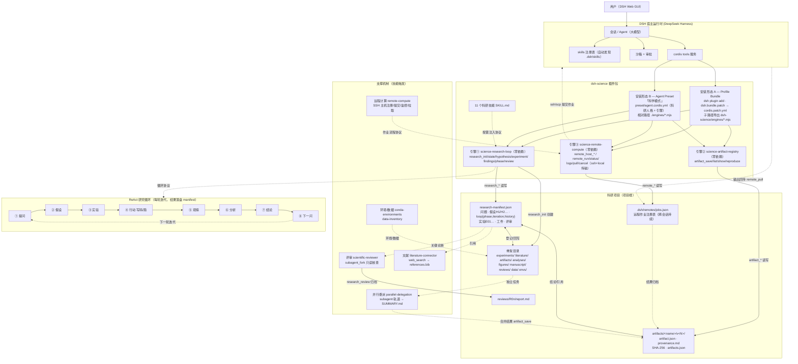

# dsh-science 技术拓扑

> 一句话：**dsh-science** 把 Claude Science 的"Project（持久化研究状态）+ ReAct 研究循环 + 版本化工件与溯源 + Reviewer 评审 + 并行委派 + 文献访问 + Remote compute clusters（SSH 远程计算）"整套范式，复刻为 DeepSeek Harness 上的零依赖 cordis 插件（三个引擎）+ 11 个科研技能。

## 工作原理（数据流）

1. **挂载**：插件以两种形态进入 DSH 运行时 ——
   - **Profile Bundle**（`dsh plugin add`）：`package.json` 的 `dsh.bundle.patch` 指向 `cordis.patch.yml`，按**子路径导出**（`dsh-science/engines/*.mjs`）把三个引擎插入 profile 层栈，该 profile 上所有 agent 可用；
   - **Agent Preset「科学模式」**：`preset/agent.cordis.yml` 以**相对路径**（`./engines/*.mjs`）挂载同一组引擎，并注入科研人格与标准工具层，按 agent 隔离。
2. **初始化**：会话开始 → `research_init` 在项目根创建 `research-manifest.json` 与骨架目录（experiments/ literature/ artifacts/ analyses/ figures/ manuscript/ reviews/ data/ envs/）；`research_state` 每次会话读取状态。
3. **循环**：Agent 按 ReAct 跑研究循环 —— `research_hypothesis`（H1/H2…）→ `research_experiment`（E01…，生成 design.md/log.md/code/ results/）→ **Act**（bash/fs 工具跑代码，沙箱+审批）→ `research_findings`（观察/分析写入 log.md，结论更新假设状态 supported/refuted/inconclusive，nextQuestion 开启下一轮）→ `research_phase` 推进阶段（literature→hypothesis→experiment→analysis→manuscript→concluded）。全部状态落盘 `research-manifest.json`，**跨会话持续**。
4. **工件**：值得引用的结果用 `artifact_save` 存为 `artifacts/<name>/v<N>/`（每文件 SHA-256 + artifact.json 溯源：命令/输入/环境 + 追加式 provenance.md + 全局 artifacts.json 索引）；`artifact_show` 查历史、`artifact_reproduce` 出复现指引。
5. **远程计算**：需要 GPU/集群/专门环境时，`remote_host_add` 注册主机（`~/.ssh/config` 别名，自动只读探测 CPU/GPU/CUDA/conda/sbatch/SLURM 分区，主机注册表 `$DSH_HOME/remotes/hosts.json`）→ `remote_run` 把脚本与输入上传到 `<scratch>/<jobId>/` 并以 detached 进程（nohup+setsid，断连不杀）或 sbatch 提交（提交前默认审批）→ `remote_status`/`remote_logs` 监控长任务（状态自动迁移 running→succeeded/failed/killed，作业注册表 `<项目根>/.dsh/remotes/jobs.json`）→ `remote_pull` 拉回输出（>100MB 大文件留主机并记录路径）→ `artifact_save` 归档。
6. **支撑机制**（技能触发）：评审用 `subagent_fork` 启动只读评审子代理对照执行记录核查论断，`research_review` 归档 `reviews/R0n/`；独立任务拆 `subagent` 并行轨道合并到 SUMMARY.md；文献用 `web_search` 维护 literature/ + references.bib；环境用 conda 导出 yaml/lock 到 envs/，数据登记到 data/（不入版本库）。
7. **验证**：`scripts/smoke-test.mjs`（125 项检查）+ `test/verify-bundle.sh`（隔离 bundle 安装+boot）；`scripts/sync-engines.sh` 保持 engines/ ↔ preset/engines/ 镜像一致。

## Mermaid 拓扑



## ASCII 拓扑

```
┌───────────────┐    ┌────────────────────────────────────────────────┐
│ 用户（Web GUI）│───▶│ DSH 宿主：会话/Agent · tools 服务 · skills 注册  │
└───────────────┘    │ 沙箱+审批 · preset 挂载点                        │
                     └───────────────┬────────────────────────────────┘
                       ┌─────────────┴─────────────┐
                       ▼                           ▼
        ┌────────────────────────┐   ┌─────────────────────────────┐
        │ ① Profile Bundle       │   │ ② Agent Preset「科学模式」   │
        │ dsh.bundle.patch →     │   │ preset/agent.cordis.yml     │
        │ cordis.patch.yml       │   │ 科研人格 + 相对路径引擎        │
        │ 子路径导出              │   │                             │
        └───────────┬────────────┘   └──────────────┬──────────────┘
                    ▼                               ▼
   ┌─────────────────────────────────────────────────────────────┐
   │ 11 个科研技能 SKILL.md（按需注入循环协议）                    │
   └─────────────────────────────────────────────────────────────┘
        │                                   │
        ▼                                   ▼
 ┌──────────────────┐              ┌────────────────────────┐
 │ 引擎① 研究循环     │              │ 引擎② 工件注册         │
 │ research_* 8 工具 │              │ artifact_* 7 工具      │
 └────────┬─────────┘              └───────────┬────────────┘
          │ research_* 读写                     │ artifact_* 读写
          ▼                                    ▼
 ┌────────────────────────┐        ┌────────────────────────┐
 │ research-manifest.json │        │ artifacts/<name>/v<N>/ │
 │ 问题/假设/循环/实验/评审  │        │ artifact.json 溯源      │
 └────────┬───────────────┘        │ provenance.md · SHA-256│
          │                        └───────────┬────────────┘
          ▼                                    │
 ┌─────────────────────────────────────────────▼──────────┐
 │ 项目骨架：experiments/ literature/ artifacts/ analyses/  │
 │ figures/ manuscript/ reviews/ data/ envs/               │
 └─────────────────────────────────────────────────────────┘
          ▲              ▲              ▲
   ┌──────┴────┐  ┌──────┴─────┐  ┌─────┴───────┐
   │ 评审子代理  │  │ 并行委派    │  │ 文献/环境/数据│
   │ reviews/   │  │ tracks→合并│  │ bib · conda │
   └────────────┘  └────────────┘  └─────────────┘

 ┌────────────────────────────────────────────────────────────┐
 │ 引擎③ 远程计算 remote_* 16 工具                              │
 │ remote_host_add/probe/notes · remote_run/status/logs/       │
 │ pull/cancel/jobs · remote_exec（ssh + local 双传输，零依赖） │
 └──────────────┬─────────────────────────────────────────────┘
                │ remote_* 读写                      │ ssh/scp
                ▼                                   ▼
 ┌────────────────────────┐            ┌────────────────────────┐
 │ .dsh/remotes/jobs.json │            │ 远程主机（工作站/HPC）   │
 │ 作业注册表（跨会话）     │◀──输出回传──│ <scratch>/<jobId>/      │
 └────────────────────────┘            └────────────────────────┘

ReAct 循环：提问 → 假设 → 实验 → 行动(写码/跑) → 观察 → 分析 → 结论 → 下一问 →（循环）
远程作业流：remote_run（审批）→ remote_status 监控 → remote_logs 查日志 →
            remote_pull 回传（大文件留主机）→ artifact_save 归档
```

SVG/PNG 版本见 [topology.svg](./topology.svg) / [topology.png](./topology.png)（图示为 v0.1.x 导出；引擎③ remote-compute 请以本文件的文本拓扑与 Mermaid 为准）。
